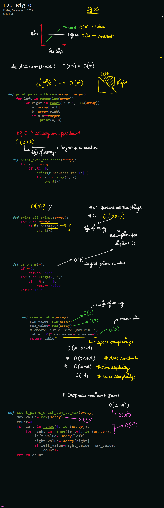

# L2. Big O




```python
# O(a), where a= size of array
def print_all_evens(array):
    for a in array:
        if a%2==0:
            print(a)


# O(a^2), where a= size of array
def print_pairs_with_sum(array, target):
    for a in array:
        for b in array:
            if a+b==target:
                print(a, b)


# O(n^2)
def print_pairs_with_sum(array, target):
    for left in range(len(array)):
        for right in range(left+1, len(array)):
            a= array[left]
            b= array[right]
            if a+b==target:
                print(a, b)


                
# O(k*a)
def print_even_sequences(array):
    for a in array:
        if a%2==0:
            print(f"Sequence for {a}")
            for k in range(0, a):
                print(k)
```